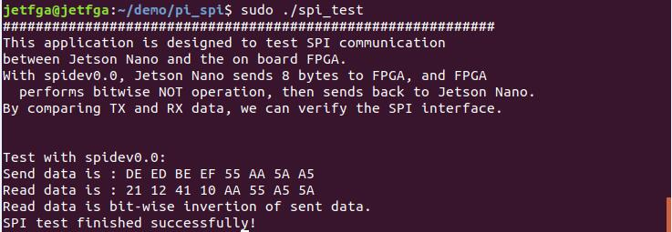

# [Hi01 board](http://www.gvi-tech.com/pro_detail/47.html)
In this repository are some tests for Hi01 board, which integrates FPGA and NVIDIA Jetson Nano Developer Kit on one board.

## Technical Detail of Hi01 board

| Product code       | Hi01(A02)                       |
| ------------------ | ------------------------------- |
| FPGA               | XC7K325T-2FFG676I               |
| Flash              | 128Mbit                         |
| Jetson Nano module | Jetson Nano Development Kit     |
| Jetson Nano RAM    | 4GB (32Gbit) LPDDR4             |
| FPGA memory        | 2GB (16Gbit)                    |
| FPGA clock         | 200Mhz                          |
| LED display        | Single FPGA RUN indication      |
| Fiber interface    | 4 SFP+                          |
| GE interface       | 1000M / 100M ethernet interface |
| USB interfaces     | 1 USB2.0, 1 USB3.0              |
| HDMI interface     | 1                               |
| Power              | 12V±10%                         |
| OS                 | Ubuntu 18.04 LTS                |


## SPI Test
Hi01 board has already enabled SPI1 and SPI2. To check it by running:
```
$ ls /dev/spi*
```
The result should be:


Compile and run SPI test:
```
$ gcc -o spi_test spi_test.cpp
$ sudo ./spi_test
```
The result should look like:



## PCIE Test

Install PCIE driver:
```
$ cd pcie_test/driver
$ sudo make install
```

Run PCIE test:
```
$ cd pcie_test/sample_app
```

Print FGPA list information:
```
$ ./testutil 0
```


Performance Test:

./testutil \<fpga_id\> \<channel_id\> \<number of words to transfer\>, e.g. :

```
$ ./testutil 2 0 0 100000000
```

The bandwidth can go up to 1.5 GB/s.


## Self Test
* Run minicom:
```
$ sudo minicom -D /dev/ttyTHS1
```

* Press ENTER key on the kerboard:


* Type '1'

